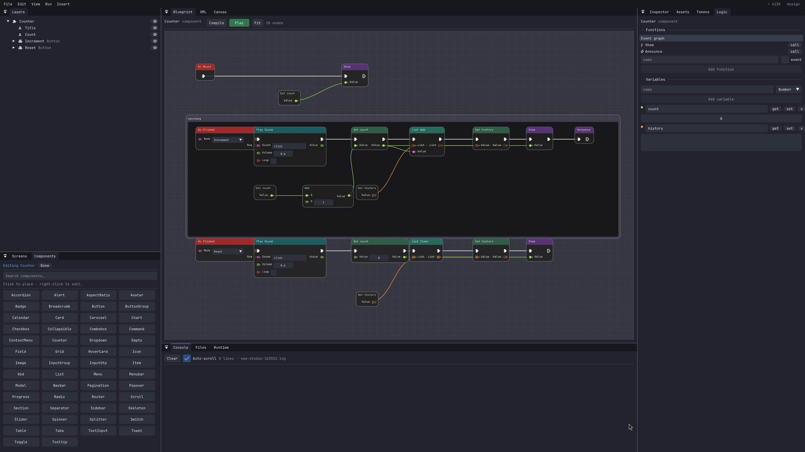

# VAE

**Virtual App Engine** — a visual builder for desktop applications. Draw the interface on a canvas,
attach logic in Lua, C++ or a blueprint, then run it or export it as C++.


## Features

- The canvas draws with the app's own renderer — the design is the running app
- 53 components: buttons, inputs, tables, charts, modals, menus, calendars
- Any component can be opened and edited; an edited one forks into the project
- Figma layout: auto-layout stacks, hug/fill/fixed sizing, absolute children with constraints
- Components declare properties and variants; instances answer them
- Design tokens and themes, dark and light
- Data-bound rows — draw one row, hand over a table at runtime
- Logic in Lua, C++ or a blueprint — nodes and wires, Unreal's model — chosen once per project
- Services for files, storage, HTTP, WebSockets, timers and audio
- SVG import, vector shapes, pictures and fonts as project assets
- Text shaped by HarfBuzz: right-to-left scripts, reordering, ligatures, colour emoji
- Translations from one flat JSON per locale
- Screen readers read an app over AT-SPI
- Undo and redo everywhere, autosave with a recovery copy
- Run a project on the canvas, or in its own window
- Documents are XML, one file per screen, diffable
- Export readable C++ that builds into a standalone folder



## Install

```sh
git clone --recursive https://github.com/mKonic/vae
cd vae
./install.sh
```

Needs a C++23 compiler, premake5 (5.0.0-beta8 or newer), `glslc`, `wayland-scanner` and the Vulkan
loader. Linux only for now.

`--copy` installs copies instead of symlinks into the clone, `--system` installs under
`/usr/local`, `--uninstall` removes it. `./install.sh --help` lists the rest.

## Usage

```sh
vae-studio                                          # the designer
vae-studio <project>                                # open one
vae-player <project> [--screen NAME] [--locale pt-BR]
vae-player <project> --headless                     # lay out and paint, no window
```

Projects live in `~/Documents/VAE`, one folder each — set `VAE_PROJECTS` to move them.

`F5` runs a project on the canvas. `Ctrl+F5` runs it in its own window, `Ctrl+F6` starting on the
screen you are looking at, and `Shift+F5` stops.

## Scripting

A script registers a class per component name. Every instance runs one, with its own state.

```lua
vae.component("Counter", {
    on_mount = function(self) self:show() end,

    on_event = function(self, event)
        if event.kind == "clicked" and event.source == "Increment" then
            self:set_state("count", self:state("count") + 1)
            self:show()
        end
    end,

    show = function(self)
        self:set_text("Count", "text", tostring(self:state("count")))
    end,
})
```

The C++ form is the same shape against `vae/script/VaeScriptAPI.h`, compiled to a `.so` beside the
project. The player loads whichever sits next to it, native winning when both do.

## Blueprints

The third form is drawn rather than written. A blueprint binds to a component or a screen by the
same names a script does, so it is a spelling of the model above rather than a second one: a
component is a class and its blueprint runs once per copy with its own state, and a screen's
blueprint is the one that reaches what is placed on it.

Two kinds of wire. A **white** one says what happens next; a **coloured** one says where a value
comes from, and its colour is its type. A node with white pins runs when execution reaches it; a
node without them is worked out where it is read.

Every node is one call in `vae/script/VaeScript.h` — the palette says which — so a blueprint can do
what a script can do and nothing else. It is stored inside the screen or component it drives, so
there is no separate file and nothing to keep in step.

Functions and custom events are second canvases with a signature, called from anywhere in the same
blueprint; lists and maps are pin types of their own. Ctrl+G collapses a selection into a function
and leaves a call where it was, working out the parameters from what crossed the boundary.

`design/blueprints.md` has the model, the execution rules and what the compiler refuses.

## Export

```sh
vae-studio --export <project> [directory]      # or File > Export C++
cd <Name>-export && premake5 gmake && make
```

The folder that comes out is the app: the binary, and beside it the fonts, pictures, translations
and script. Copy it to a machine with no VAE on it and it runs.

## Build from source

```sh
./scripts/Setup.sh                   # submodules, then premake5 gmake
./scripts/CompileShaders.sh          # GLSL -> SPIR-V
make config=debug -j8                # or config=release / config=dist
```

Binaries land in `bin/<config>-linux-x86_64/<project>/`. Re-run `premake5 gmake` after adding a
source file.

```sh
./bin/Debug-linux-x86_64/VAE-Tests/VAE-Tests
./bin/Debug-linux-x86_64/VAE-Studio/VAE-Studio --selftest
```

`VAE_GPU` picks the backend: `vulkan` (default), `software` (needs `vulkan-swrast`), `d3d12`.

## Built with it


A chat client: one screen, one Lua file, rows fed to repeating containers, WebSockets for the
transport.

## Licence

LGPL-3.0-or-later. See [COPYING.LESSER](COPYING.LESSER).

Vendored dependencies keep their own, all permissive: GLFW, Dear ImGui, Lua, sol2, spdlog, pugixml,
nlohmann/json, GLM, miniaudio, cpp-httplib, vk-bootstrap, VulkanMemoryAllocator, HarfBuzz,
ImGuiColorTextEdit, stb.
