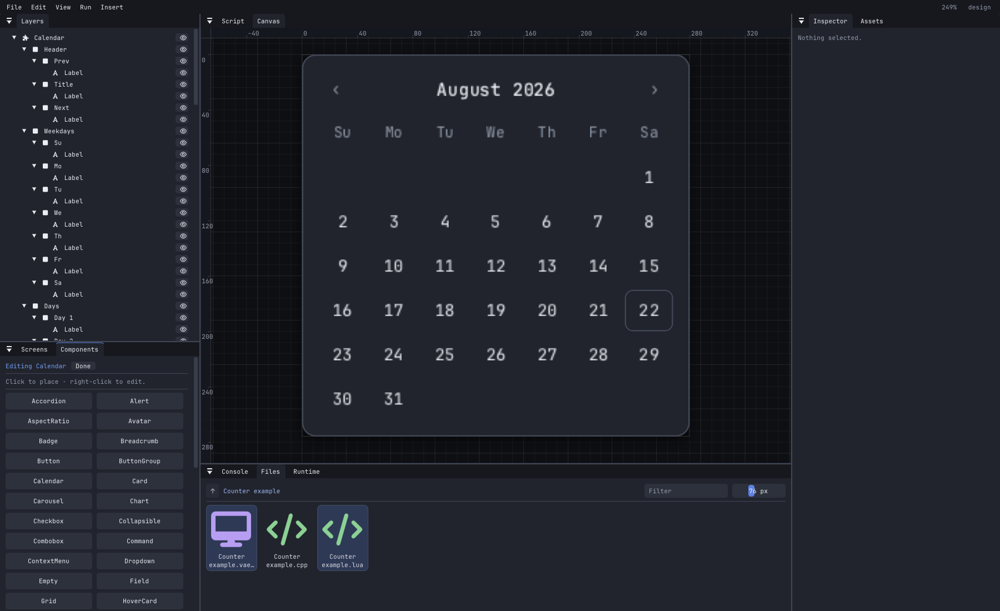
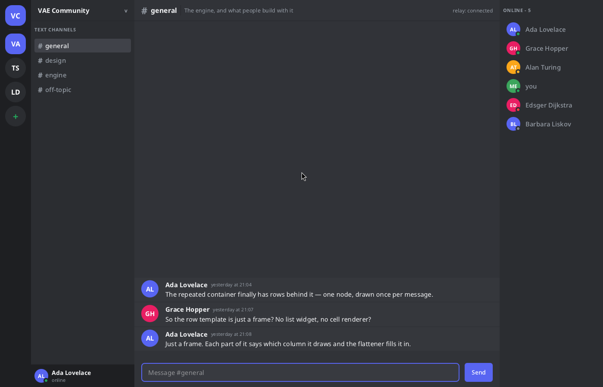

# VAE

**Virtual App Engine** — a visual builder for desktop applications. Draw the interface on a canvas,
give it layout, style and state, attach logic in Lua or C++, then run it or export it as C++.



C++23, premake5, Vulkan behind a swappable GPU abstraction, dependencies as git submodules. Linux is
the supported target.

## What it does

- **Designer.** Layers, screens, components, inspector, assets, script editor, console. The canvas is
  the runtime renderer drawing into an offscreen target, so the design and the running app are the
  same picture.
- **53 components.** Button, TextInput, Checkbox, Radio, Switch, Slider, Dropdown, Combobox, Tabs,
  Scroll, List, Table, Grid, Card, Modal, Popover, Toast, Tooltip, Menu, Menubar, Navbar, Command,
  Calendar, Carousel, Chart, Accordion, Progress and the rest. They are built from frames, text and
  layout rather than native code, so any of them can be opened and edited; an edited one is forked
  into the project and stops tracking the library.
- **Figma layout semantics.** Auto-layout stacks with hug/fill/fixed sizing, absolute children with
  edge constraints, wrap, gap, padding, alignment. Solved headlessly and unit-tested.
- **Instanced SDF rendering.** Rounded rectangles with per-corner radii, borders, solid/linear/radial
  fills, images, analytic shadows and glyph quads, all as instances in one storage buffer. A screen
  is two or three draw calls.
- **Logic in Lua or C++,** chosen once per project. Lua 5.4 through sol2, or a native module compiled
  to a `.so` and reached through a C ABI table. Components bind by name and each instance gets its
  own state.
- **Services:** files, key-value storage, HTTP, WebSockets, timers and audio.
- **Data-bound rows.** A container marked repeating plus a table of rows handed over at runtime; a
  node inside the template says which column it draws.
- **Export C++.** The document is the source of truth; export emits readable C++ against the same
  public API, plus a premake project that builds it.

## Repository layout

| Path | What |
|------|------|
| `VAE/` | Engine. Two static libraries: `VAE-Core` (headless — document, layout, reactive graph, text, codegen) and `VAE` (window, GPU, renderer, widgets, scripting, services) |
| `VAE-Studio/` | The designer |
| `VAE-Player/` | Standalone runtime for a project |
| `VAE-Tests/` | Unit tests; links `VAE-Core` only, so they need no GPU and no window |
| `VAE/vendor/` | Dependencies, as submodules |
| `vendor-build/` | premake scripts for the dependencies compiled from source |
| `scripts/` | Setup, shader compilation, Wayland protocol generation |

## Building

Needs a C++23 compiler, `premake5` (5.0.0-beta8 or newer), `glslc` (from shaderc), `wayland-scanner`,
and the Vulkan loader. Vulkan headers are vendored.

```sh
git clone --recursive <url> vae
cd vae
./scripts/Setup.sh                   # submodules + premake5 gmake
./scripts/CompileShaders.sh          # GLSL -> SPIR-V, needed once and after any shader change
make config=debug -j$(nproc)         # or config=release / config=dist
```

Binaries land in `bin/<config>-linux-x86_64/<project>/`. Re-run `premake5 gmake` after adding a
source file — the project files are generated from globs.

## Running

```sh
./bin/Debug-linux-x86_64/VAE-Studio/VAE-Studio
./bin/Debug-linux-x86_64/VAE-Player/VAE-Player <project.vaescreen> [--screen NAME]
```

Both binaries answer `--version`. The build number is `10000 + commits on HEAD` and the name is
`git describe --tags --always --dirty`, both produced by `scripts/version.sh` and generated into a
header before every build — releasing is tagging, and nothing declares a version in a file. A build
made without git says `unknown build` rather than inventing a number. Compatibility is separate and
hand-bumped: the document format version, the script ABI version and the widget-library version.

The Player loads the script beside the project — `<project>.so` or `<project>.lua`, native winning
when both exist. `--headless [--frames N]` lays out and paints without a window and exits non-zero if
the project or its script failed.

Projects live under `~/Documents/VAE` (or `$VAE_PROJECTS`), one directory each.

| Variable | Effect |
|---|---|
| `VAE_GPU` | `vulkan` (default), `d3d12`, `software`. Unimplemented backends report why and fall back. `software` routes through Mesa's lavapipe ICD and needs `vulkan-swrast`. |
| `VAE_PROJECTS` | Projects root. Otherwise `$XDG_DOCUMENTS_DIR/VAE`, then `~/Documents/VAE`. |
| `VAE_ROOT` | Engine asset root. Otherwise the engine walks up from the executable for a `.vaeroot` marker. |
| `VAE_FRAMES` | Render N frames and exit. |

## Installing

```sh
./install.sh              # build, test, and link into ~/.local
./install.sh --copy       # independent copies, so the clone is disposable
./install.sh --system     # /usr/local, sudo only for the steps that write there
./install.sh --uninstall
```

It checks the dependencies, fetches submodules, compiles the shaders, builds, runs the unit suite
and the editor selftest, and installs only if both pass. `--destdir DIR` stages a package instead of
installing.

The default is a linked install: `<prefix>/lib/vae` points at this clone, so `git pull && make
config=dist` takes effect with no reinstall — and moving the clone breaks it. `--copy` puts the
binaries and the engine's assets under the prefix instead. Either way `<prefix>/bin` gets
`vae-studio` and `vae-player`, and `<prefix>/share` gets a desktop entry, an icon, and the
`.vaescreen` file type so a project opens from a file manager.

## Documents

`.vaescreen` and `.vaecomp` are XML (format 3). The element name is the node kind, the tree is the
indentation, and only what cannot be worked out on load is written — defaults, derivable types,
unreferenced ids and the stock component catalog are all left out.

```xml
<vae version="3" library="vae.std@1" theme="dark">
  <tokens>
    <token name="accent" dark="0.365 0.51 0.894 1" light="0.29 0.44 0.85 1"/>
  </tokens>
  <screen name="Home" start="true" mode="stack" width="1280" height="800" padding="48" gap="32"
          align="center" justify="center" fill="@surface">
    <instance name="Left" of="c80f0394e2916d19" width="260"/>
  </screen>
</vae>
```

Attribute sigils: `@token`, `=binding`, `#hex`, `&node`, `*asset`, `$literal`. Sizes are `72`, `hug`,
`fill`, `fill 2` or `50%`; padding takes 1, 2 or 4 values.

Files written in the earlier JSON formats still open — `VAE-Studio --convert [--check] [--bench N]`
rewrites one in format 3, verifies the round trip node for node, or times the load.

## Languages

A text node can carry a key (`textKey`) beside the text it was authored with. `strings/<locale>.json`
in the project is a flat object of key to text — the one file a translator opens:

```json
{ "home.greeting": "Bom dia" }
```

Studio writes that file for you (View → Language → Write) with every key the document uses and the
authored text as the starting point, keeps whatever translations are already in it, and previews any
locale on the canvas. The Player takes `--locale pt-BR`, or reads `LC_ALL`/`LC_MESSAGES`/`LANG`, and
falls back from `pt-BR` to `pt`. A key with no translation draws the text the designer wrote, so a
missing string is never a blank label.

Text is shaped with HarfBuzz, so a translation is not limited to the scripts that map one character
to one glyph: Arabic and Hebrew read right to left and take their joined forms, Devanagari reorders,
marks attach to their letters, and a font's ligatures are drawn. Mixed-direction text resolves at a
paragraph level with the neutrals between runs handled per UAX #9. When neither the chosen face nor
the fallback chain has a character, VAE searches every installed family for one that does, so a
script nobody listed still draws. Colour emoji are the exception: `stb_truetype` reads outlines, not
the bitmap and layered-colour formats emoji faces use, so they draw in whatever monochrome form a
text face has.

## Scripting

A script registers classes by component name. Every instance of that component runs one, with its own
`self` and its own state.

```lua
vae.component("Counter", {
    on_mount = function(self) self:show() end,

    on_event = function(self, event)
        if event.kind ~= "clicked" then return end
        if event.source == "Increment" then
            self:set_state("count", self:state("count") + 1)
        end
        self:show()
    end,

    show = function(self)
        self:set_text("Count", "text", tostring(math.floor(self:state("count"))))
    end,
})
```

The C++ form is the same shape against `vae/script/VaeScriptAPI.h`, compiled to a `.so` beside the
project.

## Tests

```sh
./bin/Debug-linux-x86_64/VAE-Tests/VAE-Tests
./bin/Debug-linux-x86_64/VAE-Tests/VAE-Tests --filter=layout

VAE-Studio --selftest    # editor logic, no window and no device; exit code is the result
```

`--selftest` also rewrites the sample projects into the projects root.

## Built with it



A chat client: one `.vaescreen`, one Lua file, rows fed to repeating containers, WebSockets for the
transport.

## Licence

LGPL-3.0-or-later. `COPYING.LESSER` is the licence; `COPYING` is the GPLv3 it is written against.

The engine is a library, and that is the point of the choice: an app you build with VAE is your own
work and stays yours, whatever licence you put on it. What LGPL asks in return is that whoever has
your app can replace the copy of VAE inside it — which, for the static linking VAE does by default,
means shipping your object files or a build that links VAE dynamically alongside it.

Vendored dependencies keep their own licences, all permissive: GLFW (zlib), Dear ImGui, Lua, sol2,
spdlog, pugixml, nlohmann/json, GLM, miniaudio, cpp-httplib, vk-bootstrap, VulkanMemoryAllocator,
HarfBuzz and ImGuiColorTextEdit (MIT), stb (public domain).
